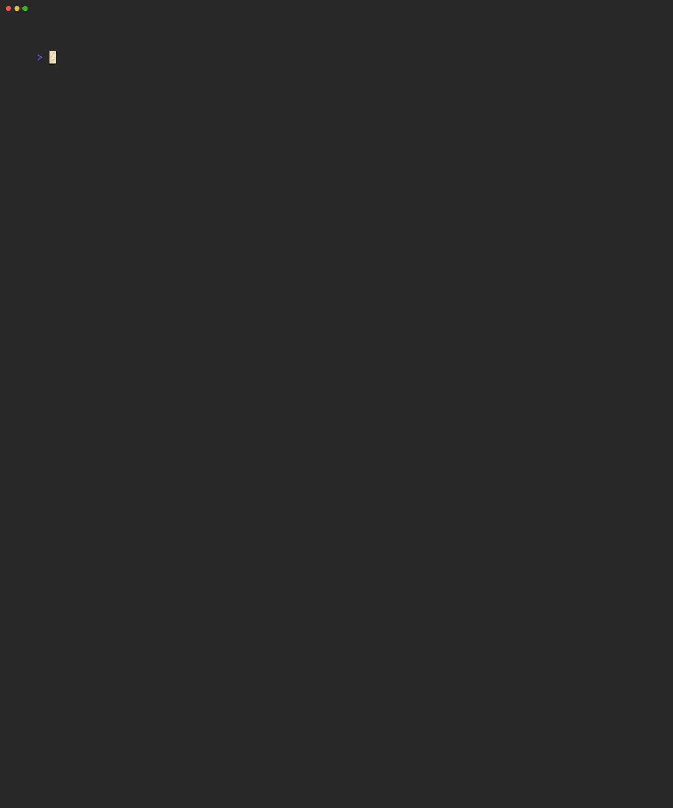

# Pincenez

[](https://www.npmjs.com/package/pincenez)
[](LICENSE)

> **0.x.** Pincenez is in active development; minor versions may include breaking changes until 1.0.

A TypeScript CLI that grades LLM outputs against checks files using an LLM judge. Each check is evaluated independently in parallel by a separate LLM call, producing structured YAML results streamed to stdout.



_Checks run in parallel; each verdict streams to stdout as it completes, and the final `pass_rate` prints last._

<!-- Source: assets/demo.tape — re-record with `vhs assets/demo.tape`. -->

## Where pincenez fits

Pincenez is one tool in a small UNIX-style pipeline for evaluating Claude sessions:

- **[scuttlerun](https://github.com/bkudria/scuttlerun)** drives a headless Claude session and emits a YAML transcript on stdout.
- **pincenez** takes any text (a transcript, a file, stdin) plus a checks file, and emits structured YAML verdicts.
- **[craboodle](https://github.com/bkudria/craboodle)** orchestrates many scuttlerun + pincenez invocations across a directory of eval scenarios, averaging across repetitions.

scuttlerun and pincenez compose by pipe — `scuttlerun session.yaml | pincenez checks.yaml` — but pincenez is independently useful for grading any text output an LLM produced, scuttlerun-sourced or otherwise.

## Installation

### Prerequisites

- **Node.js 20** or later (CI tests on 20, 22, 24).
- **`ANTHROPIC_API_KEY`** exported in your environment. Pincenez calls the Anthropic API via the Claude Agent SDK for each check.

```bash
export ANTHROPIC_API_KEY=sk-ant-...
```

See [SECURITY.md](SECURITY.md#privacy--data-flow) for what gets sent off your machine on each run.

### Install

```bash
npm install -g pincenez
```

Or run without installing:

```bash
npx pincenez checks.yaml output.md
```

## Usage

```bash
# Grade a file against a checks file
pincenez checks.yaml output.md

# Pipe from scuttlerun
scuttlerun session.yaml | pincenez checks.yaml

# Use a stronger model for all checks
pincenez checks.yaml output.md --model claude-sonnet-4-6
```

## Checks File Schema

Checks files are YAML files defining what to evaluate. Only `checks` is required.

```yaml
context: |
  The agent was asked to write a function and save it to a file.
  A CLAUDE.md instruction required writing tests before production code.

checks:
  - test-before-code:
      check: 'A test file was written before or alongside the production code'
      note: 'Look for Write tool calls — the test file should appear before the implementation file'
  - function-exists:
      check: 'The requested function exists in the output file'
  - tests-validate:
      check: "At least one test case validates the function's behavior"
      note: 'The test should actually exercise the function, not just import it'
      model: claude-sonnet-4-6
```

### Field Reference

| Field            | Required | Description                                                                        |
| ---------------- | -------- | ---------------------------------------------------------------------------------- |
| `context`        | No       | What task produced this output. Orients the judge without prescribing the answer.  |
| `checks`         | Yes      | List of binary checks to evaluate.                                                 |
| `checks[].check` | Yes      | The statement to evaluate. Phrased as an objective, verifiable claim.              |
| `checks[].note`  | No       | Grading hint for the judge. Improves human-judge alignment from ~70-80% to 93-96%. |
| `checks[].model` | No       | Model override for this check. Overrides `--model` and the default.                |

## Output

Pincenez streams grading YAML to stdout as checks complete:

```yaml
checks:
  - id: file-created
    check: 'A file named ocean.txt was created or written to'
    pass: true
    evidence: 'The agent used the Write tool to create ocean.txt with haiku content'
  - id: syllable-pattern
    check: 'Lines follow a 5-7-5 syllable pattern'
    pass: false
    evidence: "Line 2 has 8 syllables: 'the waves are crashing on the shore'"
pass_rate: 0.67
```

Results appear in arrival order (whichever check finishes first). `pass_rate` is written after all checks complete.

## Examples

The [`examples/`](https://github.com/bkudria/pincenez/tree/main/examples) directory has runnable checks/transcript pairs:

- [`examples/haiku`](https://github.com/bkudria/pincenez/tree/main/examples/haiku) — checks a haiku transcript against topic/file/syllable rules. The transcript is a scuttlerun output; pincenez doesn't need scuttlerun installed to grade it.
- [`examples/tdd`](https://github.com/bkudria/pincenez/tree/main/examples/tdd) — checks that tests were written before production code.
- [`examples/calculator`](https://github.com/bkudria/pincenez/tree/main/examples/calculator) — a scuttlerun [`scenario.yaml`](https://github.com/bkudria/pincenez/blob/main/examples/calculator/scenario.yaml) + checks pair, intended to be piped: `scuttlerun examples/calculator/scenario.yaml | pincenez examples/calculator/checks.yaml`.

Clone the repo to run them:

```bash
git clone https://github.com/bkudria/pincenez.git && cd pincenez
pincenez examples/haiku/checks.yaml examples/haiku/transcript.yaml
```

## CLI

```
pincenez [options] <checks.yaml> [output]
```

| Option              | Description                                            |
| ------------------- | ------------------------------------------------------ |
| `--model <model>`   | LLM judge model (default: claude-haiku-4-5)            |
| `--context <text>`  | Override or supplement the checks file's context field |
| `--concurrency <n>` | Max parallel checks (default: 10)                      |
| `--verbose`         | Include verbose output on stderr                       |
| `-V, --version`     | Show version                                           |
| `-h, --help`        | Show help with full checks file schema reference       |

### Lint

Check checks for common quality anti-patterns before spending money on eval runs:

```bash
pincenez lint checks.yaml
pincenez lint checks.yaml --context "The prompt that produced this output"
```

Detects 7 anti-patterns: vague, compound, tautological, always_passes, unverifiable, over_specific, unfalsifiable. Accepts the same `--model`, `--context`, and `--concurrency` flags as grading; lint's default model is `claude-sonnet-4-6` (vs grading's `claude-haiku-4-5`).

Output (streamed YAML, arrival order):

```yaml
checks:
  - id: file-created
    check: 'A file named ocean.txt was created or written to'
    issues: []
  - id: syllable-pattern
    check: 'Lines follow a 5-7-5 syllable pattern'
    issues:
      - anti_pattern: vague
        suggestion: "Replace 'roughly' with a numeric tolerance, e.g. '±1 syllable'"
checks_total: 2
checks_with_issues: 1
```

`checks_total` and `checks_with_issues` are written after all checks settle; `cost_usd` is appended when > 0. Like grade, `lint` exits 0 on completion regardless of `checks_with_issues` — downstream consumers parse the YAML to detect issue presence.

## Exit Codes

Subset of the shared scuttlerun/pincenez/craboodle taxonomy — see [scuttlerun/README.md#exit-codes](https://github.com/bkudria/scuttlerun#exit-codes) for the canonical table. Source: [`src/exit-codes.ts`](src/exit-codes.ts).

| Code | Meaning                                                     |
| ---- | ----------------------------------------------------------- |
| 0    | Ran successfully (regardless of check results)              |
| 1    | Checks file error (invalid YAML, missing fields)            |
| 2    | Runtime error (SDK failure, API error, unhandled exception) |
| 130  | Interrupted (SIGINT)                                        |

`lint` follows the same taxonomy and does not signal issue presence through its exit code: a clean run is 0 whether or not any checks have issues. Detect issues by parsing the `checks_with_issues` summary field.

## Composition

```bash
# Standalone grading
pincenez checks.yaml output.md > grading.yaml

# Pipe from scuttlerun
scuttlerun session.yaml | pincenez checks.yaml

# CI quality gate
scuttlerun test-scenario.yaml | pincenez checks.yaml | yq -e '.pass_rate >= 0.8'

# Grade a specific output
pincenez checks.yaml output.md > grading.yaml
```

## Development

```bash
npm install
npm run build            # TypeScript compilation
npm test                 # Run all tests (vitest)
npm run test:watch       # Watch mode
npm run test:coverage    # Tests with coverage report
npm run dev -- examples/haiku/checks.yaml examples/haiku/transcript.yaml   # Run via tsx
```

## Contributing

- [CONTRIBUTING.md](CONTRIBUTING.md) — Development setup, tests, commit conventions, PR workflow
- [CODE_OF_CONDUCT.md](CODE_OF_CONDUCT.md) — Community guidelines
- [SECURITY.md](SECURITY.md) — Reporting a vulnerability
- [SUPPORT.md](SUPPORT.md) — Where to ask questions and report bugs
- [CHANGELOG.md](CHANGELOG.md) — Release history
- [RELEASING.md](RELEASING.md) — How releases are cut (Conventional Commits → release-please → npm publish)

## See Also

- [GOALS.md](GOALS.md) — Design philosophy and research principles
- [pincenez.allium](pincenez.allium) — Full specification (Allium)

## License

[MIT](LICENSE)
